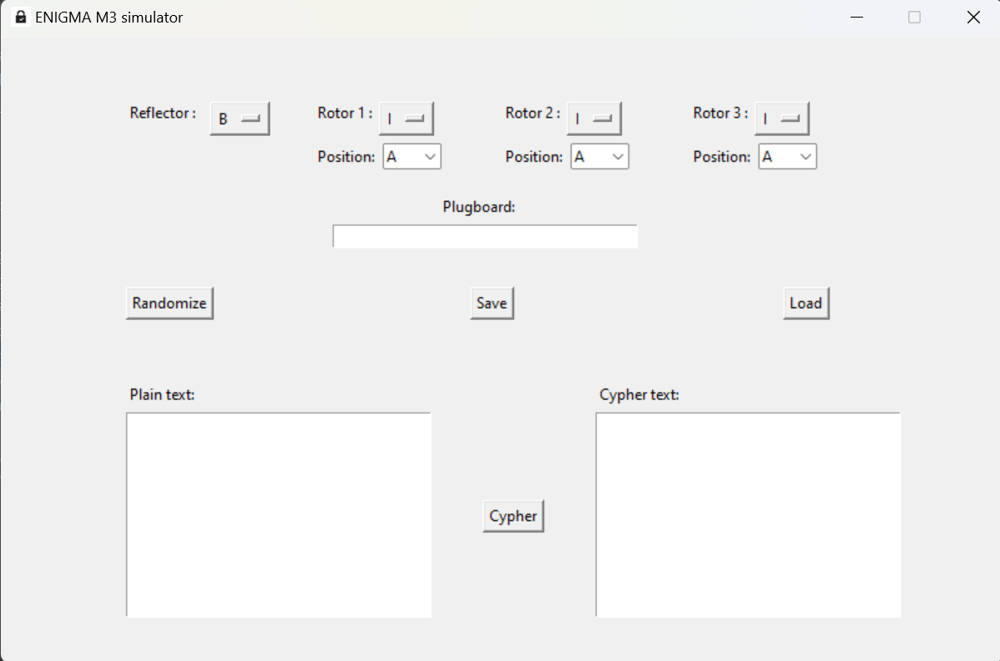
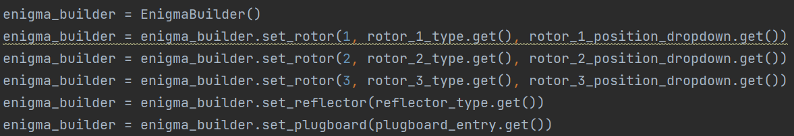

*Author: Pierre HAVARD*   
*Date: April 2024*
# ENIGMA M3 Simulation

## Introduction

#### What is the application ?
My application is an Enigma M3 simulation. It is possible to configure the enigma machine the way you want even 
if it was not historically possible. For example with this simulation it is possible to have multiples rotors of the 
same type in the simulation or more than 10 pairs of letters wired in the plugboard.

#### How to run de program ?
It is very simple, you just need to execute the main.py file at the root of the project. 
This project only uses libraries from the
[Python Standard Library](https://docs.python.org/3.8/library/).
It means that you do not need to install anything expect Python to run this project on your computer.

#### How to use the program ?

##### Settings
After executing the main.py script you should see the following GUI:

You can change the settings of the Enigma M3 simulation in the upper part of the window. 
The only tricky setting is the plugboard. To configure it properly you have to input letters by pairs separated by one 
or more spaces. It does not matter if the letters are uppercase or lowercase. Here is an example or correct plugboard 
settings:

**ZO GP EY NW LB TA UM**  
**Gu XI zE AV qj DS**  

There cannot be more than 13 letters couples because one letter can be in only one couple.
The rest of the settings seem pretty straightforward. However, it is important to understand
that the position of a rotor and the ring setting of a rotor are two things completely different. It is not possible 
to change the ring setting or the rotors in this application (it was not used historically).

##### Cypher the message
Once you have selected the settings you can type your text in the plain text box and click the cypher button. To 
decypher the message you just have to set the same settings you were using to cypher the message and type the cyphered 
text in the plain text box. Then you can click cypher, and the plain text will appear in the cypher text box. 

##### Save and Load
Remembering all the exact settings can be difficult that's why it is possible to save the settings of the simulation at
any time by simply pressing the save button. The settings that will be saved are the ones that are displayed when 
clicking the save button. 

You can load settings by clicking the load button. It is only possible to load *.enigma* files. If you load an incorrect
file the program will not crash and will just ignore the file you tried to load.

No matter what you do on the application the settings that will be used for your actions (save or cypher) are the ones 
that are displayed when you do those actions. 

## Analysis

The main part of the program is the enigma simulation. To implement enigma I used two python design patterns:

- Builder
- Template method

### The builder
The builder is very useful because the data given by the graphical interface cannot be directly given to the Enigma 
constructor. It has to be processed first and that's what the builder does. It allows to create the Enigma instance 
step-by-step. Here is how the builder is used:  

### The template method

The template method design pattern was very useful to create similar object like the rotors and the reflectors. 
They all behave the same way, but they differ by the attributes they have, and it would make no sense to instantiate a 
rotor or a reflector without giving its type.

### The graphical interface

For the graphical interface, *tkinter* is used. Using *tkinter* both makes the manipulation of the 
data the user entered very easy and the interface intuitive to use for the user.

### The file system

The file system is powered by Pickle. It is a module that allows to save and load python objects in and from files. 
Naturally, for this application the object saved is the enigma machine. And then the object that is loaded is an
enigma instance. 

## Results and Summary
### Results
- Main challenge: understanding how the enigma machine works
- Builder design pattern learned, very useful for complicated objects
- Pickle module discovered, very practical to save objects

## Conclusions

With this project I learned a lot, especially concerning classes and objects. It is also the first time I use a builder.
I discovered the Pickle module which helped me a lot to manage files. Tkinter and Pickle were very good choices because 
they allowed me to implement a lot of functionalities very easily.

This work as achieved a fully functioning enigma M3 simulation in Python.

The future prospects of my program are:   
- implementing the ring setting
- implementing the M4 enigma version
- implementing an historical mode

## Resources

Here are the resources I used during this project. Make sure that you understand how the enigma machine work before you
look at the code.  

### Understand how ENIGMA works

- [YouTube 3D simulation](https://www.youtube.com/watch?v=ybkkiGtJmkM)
- [Technical Details](https://www.ciphermachinesandcryptology.com/en/enigmatech.htm)
- [Video lecture](https://www.youtube.com/watch?v=mcX7iO_XCFA)
- [Enigma's Wikipedia](https://en.wikipedia.org/wiki/Enigma_machine)

### Simulations online:

Here are the two simulators I mainly used:

- [Detailed emulator](https://www.101computing.net/enigma-machine-emulator/)
- [Simulation to check quickly](https://cryptii.com/pipes/enigma-machine)
